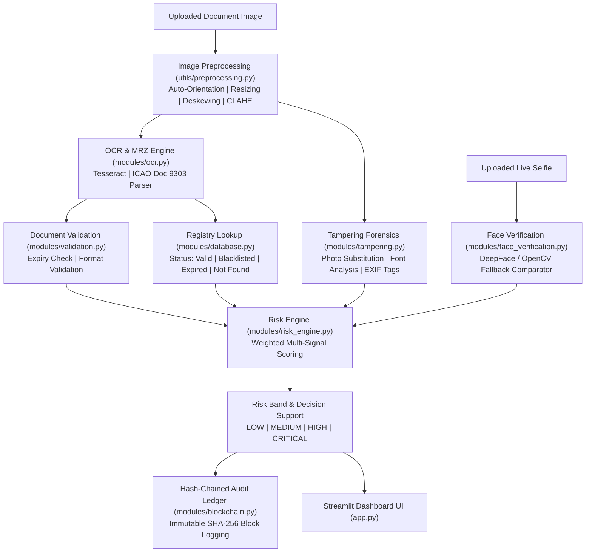

# 🛂 VeriScan AI — Identity & Travel Document Screening System

**VeriScan AI** is an intelligent decision-support platform designed for border security, identity verification, and document screening. It wires together Optical Character Recognition (OCR), Machine Readable Zone (MRZ) extraction, document validation, registry checks, image forgery forensics, biometric face verification (`DeepFace`), and a hash-chained audit ledger behind a clean, responsive Streamlit interface.

---

## 📌 Key System Features

- 📄 **Multi-Format Document OCR & Field Extraction**:
  - Powered by Tesseract OCR with built-in fallback pipelines.
  - **ICAO Doc 9303 MRZ Engine**: Extracts structured fields (`Name`, `Passport Number`, `Nationality`, `Date of Birth`, `Date of Expiry`, `Gender`) from standard 2-line passport MRZ zones.
  - **Universal Field Parsers**: Supports Passports, Visas, Driving Licenses, National IDs, and Permits.
  - **Per-Field Confidence Scoring**: Assigns a 0–100% confidence rating to every extracted field based on OCR engine metrics and pattern matching.

- 🔍 **Document Validation & Consistency Checks**:
  - Validates logical dates (Birth Date vs. Expiry Date).
  - Checks document expiration against current system time.
  - Validates document number shapes and country codes.

- 🗄️ **Registry Database Verification**:
  - Cross-references extracted document numbers against a central registry database (`modules/database.py`).
  - Identifies document status: `Valid`, `Expired`, `Blacklisted`, or `Not Found`.

- 🛡️ **Image Forensics & Tampering Detection**:
  - Detects photo substitution, digital text manipulation, font inconsistencies, and EXIF software signatures (e.g., Photoshop edits).
  - Generates a composite 0–100 Tampering Anomaly Score.

- 👤 **Biometric Face Verification**:
  - Compares the photo extracted from the document against a live/uploaded selfie.
  - Supports `DeepFace` neural embeddings with a robust OpenCV Haar Cascade fallback comparator.

- ⚖️ **Multi-Signal Risk Scoring Engine**:
  - Aggregates document validation, registry status, tampering score, and face match similarity into a single 0–100 Risk Score.
  - Classifies risk into four decision-support bands:
    - 🟢 **LOW Risk** (0–20)
    - 🟡 **MEDIUM Risk** (21–50)
    - 🟠 **HIGH Risk** (51–75)
    - 🔴 **CRITICAL Risk** (76–100) — *Hard-floored for registry blacklist hits*.

- 🔗 **Hash-Chained Audit Ledger**:
  - Cryptographically logs every screening operation into an append-only, SHA-256 hash-chained ledger (`modules/blockchain.py`) for auditability and tamper evidence.

---

## 📋 Required Libraries & Dependencies

The complete list of required dependencies is specified in [`requirements.txt`](file:///d:/version/veriscan_ai_3/requirements.txt):

| Package | Category | Purpose |
| :--- | :--- | :--- |
| **`streamlit`** | Web Framework | Interactive decision-support dashboard UI |
| **`opencv-python`** | Computer Vision | Image preprocessing, deskewing, CLAHE, and facial detection |
| **`pillow`** | Image Utilities | Image loading and format conversions |
| **`numpy`** | Numerical Computations | Image array manipulations and matrix math |
| **`pytesseract`** | OCR Engine | Python wrapper for Tesseract OCR text extraction |
| **`python-dateutil`** | Date Parsing | Flexible date parsing for document expiration and validity rules |
| **`deepface`** | Biometrics | Neural deep-learning face verification engine |
| **`tf-keras`** | Deep Learning | Keras backend required by DeepFace |
| **`tensorflow`** | Deep Learning | Machine learning runtime framework for DeepFace |
| **`scikit-image`** | Feature Extraction | HOG descriptor extraction and image forgery metrics |
| **`pytest`** | Testing | Automated test runner for pipeline integration |

---

## 🔄 System Architecture & Workflow



---

## 🛠️ Module Architecture Breakdown

| Module File | Purpose & Responsibilities |
| :--- | :--- |
| **[`app.py`](file:///d:/version/veriscan_ai_3/app.py)** | Streamlit entry point. Drives the interactive UI tabs: Upload & Scan, Dashboard, Audit Trail, and Settings. |
| **[`modules/ocr.py`](file:///d:/version/veriscan_ai_3/modules/ocr.py)** | OCR text extraction, ICAO Doc 9303 MRZ parsing (`extract_mrz`), visual regex heuristics, per-field confidence scoring, and multi-pass OCR. |
| **[`modules/validation.py`](file:///d:/version/veriscan_ai_3/modules/validation.py)** | Validates logical fields, date sanity checks, expiration checks, and generates pass/warning/fail validation reports. |
| **[`modules/database.py`](file:///d:/version/veriscan_ai_3/modules/database.py)** | Manages mock registry database queries, document number normalization, and blacklist checks. |
| **[`modules/tampering.py`](file:///d:/version/veriscan_ai_3/modules/tampering.py)** | Image forensics analyzer: text line consistency, noise discontinuities around photo crops, and EXIF software metadata analysis. |
| **[`modules/face_verification.py`](file:///d:/version/veriscan_ai_3/modules/face_verification.py)** | Detects faces in document photos and live selfies (`compare_faces`), calculating a similarity percentage verdict. |
| **[`modules/risk_engine.py`](file:///d:/version/veriscan_ai_3/modules/risk_engine.py)** | Aggregates all signal scores, applies hard risk floors (e.g. blacklist hits), classifies risk bands, and generates human recommendations. |
| **[`modules/blockchain.py`](file:///d:/version/veriscan_ai_3/modules/blockchain.py)** | Implements an immutable SHA-256 hash-chained block ledger that records all screening events. |
| **[`utils/preprocessing.py`](file:///d:/version/veriscan_ai_3/utils/preprocessing.py)** | OpenCV image pipeline: orientation normalization, CLAHE contrast enhancement, denoising, and deskewing. |
| **[`utils/helpers.py`](file:///d:/version/veriscan_ai_3/utils/helpers.py)** | General formatting helpers and badge color mappings. |

---

## 🚀 Step-by-Step Installation & Setup Guide

### 1. System Prerequisites

#### A. Python Environment
- **Python Version**: Python 3.9+ (Python 3.10 – 3.14 supported).

#### B. Tesseract OCR Binary (Required for Text Extraction)
Tesseract OCR must be installed at the OS level:
- **Windows**: Download the installer from [UB-Mannheim Tesseract OCR](https://github.com/UB-Mannheim/tesseract/wiki) and ensure `C:\Program Files\Tesseract-OCR` is added to your system `PATH`.
- **Ubuntu / Debian**:
  ```bash
  sudo apt update && sudo apt install -y tesseract-ocr
  ```
- **macOS**:
  ```bash
  brew install tesseract
  ```

---

### 2. Installation Steps

#### Step 1: Clone & Navigate to Project Directory
```bash
git clone https://github.com/debasisswain28022-maker/veriscan_ai.git
cd veriscan_ai
```

#### Step 2: Create & Activate a Virtual Environment (Optional but Recommended)
- **Windows (PowerShell)**:
  ```powershell
  python -m venv venv
  .\venv\Scripts\Activate.ps1
  ```
- **Linux / macOS**:
  ```bash
  python3 -m venv venv
  source venv/bin/activate
  ```

#### Step 3: Install Required Python Dependencies
Run `pip` to install all required libraries from [`requirements.txt`](file:///d:/version/veriscan_ai_3/requirements.txt):

```bash
pip install -r requirements.txt
```

#### Step 4: Verify Face Verification & Core Backend Status
Run this test command to confirm `DeepFace` and core modules load properly:

```bash
python -c "import modules.face_verification as fv; print('DeepFace Active:', fv._DEEPFACE_AVAILABLE)"
```

---

### 3. Running the Application

#### Launch the Streamlit Web Application
Run the interactive decision-support UI:

```bash
streamlit run app.py
```

Open your browser and navigate to **[http://localhost:8501](http://localhost:8501)**.

---

### 4. Running the Automated Test Suite

To run end-to-end integration and unit tests:

```bash
pytest
```

---

## ❓ Troubleshooting

- **`tesseract is not installed or it's not in your PATH`**:
  Ensure the Tesseract OCR binary is installed and its folder is added to your OS `PATH`.
- **DeepFace Fallback Warning**:
  If `DeepFace` or `TensorFlow` dependencies are missing, `modules/face_verification.py` will display a warning note and automatically operate using its OpenCV fallback comparator so the application runs without failing.

---

## 📄 License
This project is licensed under the MIT License.
