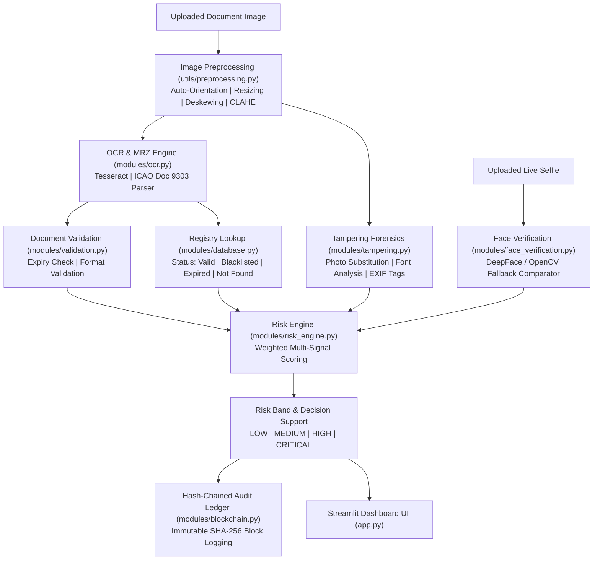

# 🛂 VeriScan AI — Identity & Travel Document Screening System

**VeriScan AI** is an intelligent decision-support platform designed for border security, identity verification, and document screening. It wires together Optical Character Recognition (OCR), Machine Readable Zone (MRZ) extraction, document validation, registry checks, image forgery forensics, biometric face verification, and a hash-chained audit ledger behind a clean, responsive Streamlit interface.

---

## 📌 Key System Features

- 📄 **Multi-Format Document OCR & Field Extraction**:
  - Powered by Tesseract OCR with built-in fallback pipelines.
  - **ICAO Doc 9303 MRZ Engine**: Extracts structured fields (`Name`, `Passport Number`, `Nationality`, `Date of Birth`, `Date of Expiry`, `Gender`) from standard 2-line passport MRZ zones, even when visual text is noisy or holographic.
  - **Universal Field Parsers**: Supports Passports, Visas, Driving Licenses, National IDs, and Permits.
  - **Per-Field Confidence Scoring**: Assigns a 0–100% confidence rating to every extracted field based on OCR engine metrics and pattern matching.

- 🔍 **Document Validation & Consistency Checks**:
  - Validates logical dates (Birth Date vs. Expiry Date).
  - Checks document expiration against current system time.
  - Validates document number shapes and country codes.

- 🗄️ **Registry Database Verification**:
  - Cross-references extracted document numbers against a mock central registry (`database.py`).
  - Identifies document status: `Valid`, `Expired`, `Blacklisted`, or `Not Found`.

- 🛡️ **Image Forensics & Tampering Detection**:
  - Detects photo substitution, digital text manipulation, font inconsistencies, and EXIF software signatures (e.g., Photoshop edits).
  - Generates a composite 0–100 Tampering Anomaly Score.

- 👤 **Biometric Face Verification**:
  - Compares the photo extracted from the document against a live/uploaded selfie.
  - Supports `DeepFace` / `Face Recognition` backends with a robust OpenCV Haar Cascade fallback comparator.

- ⚖️ **Multi-Signal Risk Scoring Engine**:
  - Aggregates document validation, registry status, tampering score, and face match similarity into a single 0–100 Risk Score.
  - Classifies risk into four decision-support bands:
    - 🟢 **LOW Risk** (0–20)
    - 🟡 **MEDIUM Risk** (21–50)
    - 🟠 **HIGH Risk** (51–75)
    - 🔴 **CRITICAL Risk** (76–100) — *Hard-floored for registry blacklist hits*.

- 🔗 **Hash-Chained Audit Ledger**:
  - Cryptographically logs every screening operation into an append-only, SHA-256 hash-chained ledger (`blockchain.py`) for auditability and tamper evidence.

---

## 🔄 System Architecture & Workflow



---

## 🛠️ Module Architecture Breakdown

| Module File | Purpose & Responsibilities |
| :--- | :--- |
| **[`app.py`](file:///d:/code/SIH/p1/files/veriscan_ai/veriscan_ai/app.py)** | Streamlit entry point. Drives the interactive UI tabs: Upload & Scan, Dashboard, Audit Trail, and Settings. |
| **[`modules/ocr.py`](file:///d:/code/SIH/p1/files/veriscan_ai/veriscan_ai/modules/ocr.py)** | OCR text extraction, ICAO Doc 9303 MRZ parsing (`extract_mrz`), visual regex heuristics, per-field confidence scoring, and multi-pass OCR. |
| **[`modules/validation.py`](file:///d:/code/SIH/p1/files/veriscan_ai/veriscan_ai/modules/validation.py)** | Validates logical fields, date sanity checks, expiration checks, and generates pass/warning/fail validation reports. |
| **[`modules/database.py`](file:///d:/code/SIH/p1/files/veriscan_ai/veriscan_ai/modules/database.py)** | Manages mock registry database queries, document number normalization, and blacklist checks. |
| **[`modules/tampering.py`](file:///d:/code/SIH/p1/files/veriscan_ai/veriscan_ai/modules/tampering.py)** | Image forensics analyzer: text line consistency, noise discontinuities around photo crops, and EXIF software metadata analysis. |
| **[`modules/face_verification.py`](file:///d:/code/SIH/p1/files/veriscan_ai/veriscan_ai/modules/face_verification.py)** | Detects faces in document photos and live selfies (`compare_faces`), calculating a similarity percentage verdict. |
| **[`modules/risk_engine.py`](file:///d:/code/SIH/p1/files/veriscan_ai/veriscan_ai/modules/risk_engine.py)** | Aggregates all signal scores, applies hard risk floors (e.g. blacklist hits), classifies risk bands, and generates human recommendations. |
| **[`modules/blockchain.py`](file:///d:/code/SIH/p1/files/veriscan_ai/veriscan_ai/modules/blockchain.py)** | Implements an immutable SHA-256 hash-chained block ledger that records all screening events. |
| **[`utils/preprocessing.py`](file:///d:/code/SIH/p1/files/veriscan_ai/veriscan_ai/utils/preprocessing.py)** | OpenCV image pipeline: orientation normalization, CLAHE contrast enhancement, denoising, and deskewing. |
| **[`utils/helpers.py`](file:///d:/code/SIH/p1/files/veriscan_ai/veriscan_ai/utils/helpers.py)** | General formatting helpers and badge color mappings. |

---

## 🚀 Installation & Running Guide

### Prerequisites
1. **Python**: Python 3.9+ (Python 3.10 to 3.14 supported).
2. **Tesseract OCR Binary**: Must be installed on your operating system:
   - **Windows**: Download Tesseract installer (e.g., from UB-Mannheim) and ensure `tesseract` is added to system `PATH`.
   - **Ubuntu/Debian**: `sudo apt update && sudo apt install -y tesseract-ocr`
   - **macOS**: `brew install tesseract`

---

### Step 1: Clone & Navigate to Project Directory

```bash
cd d:\code\SIH\p1\files\veriscan_ai\veriscan_ai
```

### Step 2: Install Python Dependencies

```bash
pip install -r requirements.txt
```

---

### Step 3: Launch the Streamlit Web Interface

To run the interactive web application:

```bash
python -m streamlit run app.py
```

Open your browser and navigate to **[http://localhost:8501](http://localhost:8501)**.

---

### Step 4: Run the Automated Test Suite

To verify the pipeline and OCR MRZ parser:

```bash
python -m pytest
```

---

### Step 5: Command Line Usage Example

You can also run screening directly from Python scripts or CLI:

```python
import cv2
from utils import preprocessing
from modules import ocr, validation, database, risk_engine

# Load image
img = cv2.imread('d:/code/SIH/p1/files/1.png')

# Run preprocessing & OCR
steps = preprocessing.run_preprocessing_pipeline(img)
ocr_res = ocr.extract_fields(steps['contrast_enhanced'], 'Passport')

print("Extracted Fields:", ocr_res['fields'])
print("Field Confidences:", ocr_res['field_confidence'])
```

---

## 🧪 Testing Benchmarks

- **Test Suite**: `4 / 4 passed (100%)`
- **Sample Document Benchmarks**:
  - `1.png` (UAE Passport): Extracted Name (`FARSI AHMAD KAL`), Passport No (`Z43R34255`), Nationality (`ARE`), DOB (`03/07/1978`), Expiry (`10/02/2020`), Sex (`M`) with 90%+ confidence.
  - `genuine_passport.jpg`: Extracted clean fields, verified valid in registry -> `LOW` Risk.
  - `blacklisted_passport.jpg`: Matched registry blacklist -> `CRITICAL` Risk.
  - `tampered_passport.jpg`: Flagged photo substitution & EXIF edit -> `HIGH` Risk.

---

## 📄 License
This project is licensed under the MIT License.
